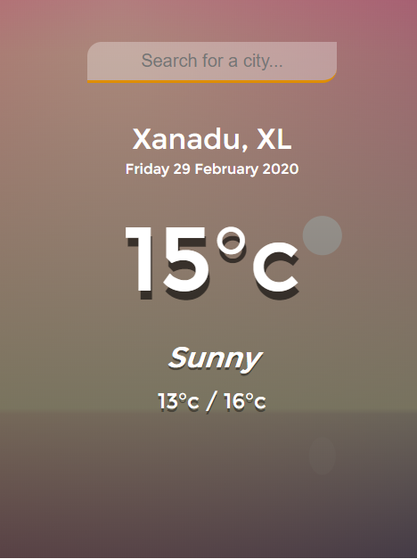

# Weather App

* The initial idea of the coding style came from [Tyler Potts](https://www.youtube.com/watch?v=n4dtwWgRueI)
* Later I tried on my using async function own and added a few features to it.
* [Live](https://weather-td.netlify.app/)

